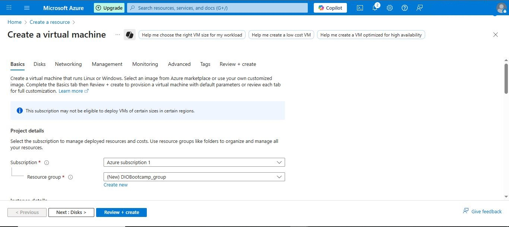

# DIO-bootcamp-azure-vm
Desafio DIO: criação de VM Windows no Azure + documentação com prints
=======
# 🚀 Desafio DIO — Criando sua Primeira Máquina Virtual no Azure

> **Bootcamp DIO •   
> Documentação do laboratório de criação de uma VM Windows no Microsoft Azure e boas práticas para publicação no GitHub.

## 🎯 Objetivo
Criar e configurar uma **Máquina Virtual (VM)** no **Microsoft Azure**, testar o acesso remoto e **documentar o processo** neste repositório para avaliação do desafio.

## 🧩 Ambiente Utilizado
- **Azure Portal**: https://portal.azure.com
- **Sistema Operacional da VM**: *Windows Server 2022 Datacenter* 
- **Tamanho da VM**: *B1s* (básico, baixo custo) 
- **Acesso**: RDP (Área de Trabalho Remota)

## 🖼️ Evidências (prints)

- Creating a Virtual Machine  
  

  - Setup a Virtual Machine  
  

  - Setup a Virtual Machine  
  

  - Setup a Virtual Machine  
  

  - Setup a Virtual Machine  
  

  - Setup a Virtual Machine  
  

  - Initializing a Virtual Machine  
  
  
- Create VM  
  

## ✅ Resultados e Aprendizados
- Criação e configuração de VM no Azure
- Acesso remoto via RDP
- Documentação técnica com **Markdown** e **GitHub**
- Boas práticas de **gestão de custos** no Azure

---

## 👤 Autor
**José Amaury**  
GitHub: https://github.com/joseamaury

> 📌 *Este repositório é parte do desafio prático da DIO. 

